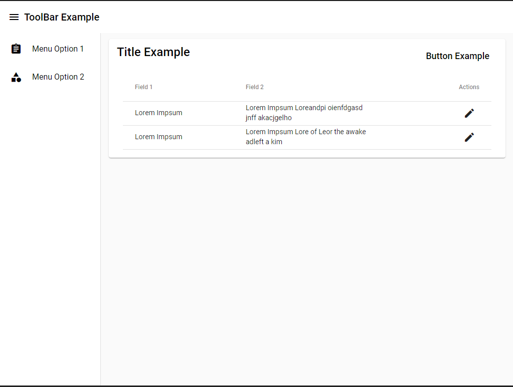
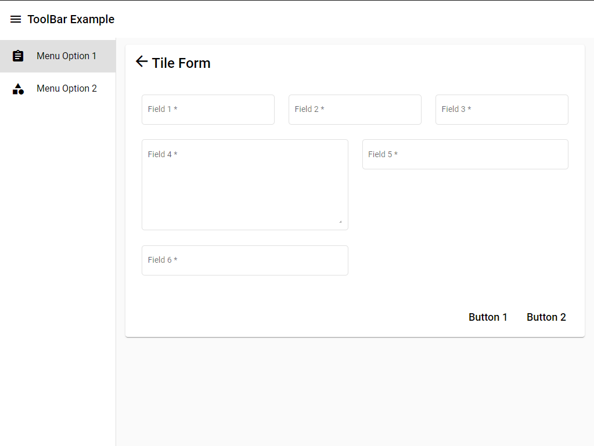

# Refera - FrontEnd PL Code Challenge

## Description
Welcome to Refera's PL FrontEnd Code Challenge!

The objective of this challenge is to develop a web application, so that we can register our customers and our orders, following the **Acceptance criteria**,
create a **responsive** web application, following some design patterns, which will be described in "Resources".


### Design and Components
- Develop a "Toolbar" with a left-aligned "hamburger" menu button followed by your app's Title.
- Develop a "Side Menu" to list the 2 application registrations, "Customer Registration", and "Order Registration", this menu will be opened or expanded when we click on the "hamburger" toolbar button.

### Customer Register
For this application, you will need to use an API, to list our customers. You don't need to implement this API, or any backend functionality.
Just use this API for clients: https://jsonplaceholder.typicode.com/users and Create a list of clients consumed in the API.

Create the "New Customer" button, which will open the form for registering customers.

In the customer form, you will have the following fields:
- Full name
- Birth date
- CPF
- Email
- Phone Number

Pay attention to the CPF, Email and Telephone fields, add masks to these fields for their consistency. Also create a consistency so that the "Save" button on the form is disabled until all fields in the form are filled out.

When clicking on button "Save", a dialog message should be displayed with the following message "Saved successfully". Attention, it is not necessary to save the data, just display the message. By clicking on the "Cancel" button, you must clear the form fields, and return to the customer list.

### Order Register
For order registration, it will not be necessary to consume an API. Just create an Array of Objects with the data of Orders Already Registered.
Copy the Array below and add in your code:

```javascript
[
  {
    nameCustomer: 'João Paulo',
    phoneCustomer: '47998651514',
    email: 'joao.paulo@company.com',
    titleOrder: 'Pedido 1',
    descOrder: 'Pedido de compra referente aos materiais de construção',
    deadline: new Date()
  },
    {
    nameCustomer: 'Pedro Dantas',
    phoneCustomer: '47994527623',
    email: 'pedro.dantas@company.com',
    titleOrder: 'Pedido 2',
    descOrder: 'Pedido de compra referente aos serviços hidráulicos',
    deadline: new Date()
  },
    {
    nameCustomer: 'Maria João',
    phoneCustomer: '47992345686',
    email: 'maria.joao@company.com',
    titleOrder: 'Pedido 3',
    descOrder: 'Pedido de compra referente à retirada de móveis do apartamento',
    deadline: new Date()
  }
]
```
Create an order listing with the order array mentioned above.
In the order list, add an "Edit" button, where you will get the order data from the line, and open this data in the order form.

Create a "New Order" button, which will open the order registration form, which will have the following fields:

Customer data (It is not necessary to search the API, only the fields themselves):
- Name
- Telephone
- Email

Order Data:
  - Title
  - Description
  - Deadline

Follow the same rules standards that were used for the customer form, use masks in the fields, enable the save button only after all fields are filled out.
By clicking on "Save", collect the data from the completed form, and add it to the Order Array. Then clear the form fields, and return to the Order list with the following message "Saved Successfully". The Completed Order must appear in the listing.

We use React in the FrontEnd of our real application, but feel comfortable choosing an appropriate technology that you are familiar with. We recommend using frameworks like Angular, or React, or any similar ones. For the creation of the screen components, feel comfortable to use Bootstrap, Angular Material, Material Design, or any other similar component library.

## Resources

Use the images below as an example to create your application.
Feel free to choose the colors, Design patterns, etc.

  


## Acceptance criteria

- Provides clear instructions on how to run the app in development mode
- A webpage, following the low-fidelity prototype presented in **Resources**
- Components
 - Navigation between Menu options
 - Responsive Design
 - Creation of the ToolBar
- Customer base
  - Table with "registered" customer data
  - Button to open the customer registration form, "New Customer"
  - Registration form with the consistencies mentioned above
  - Mask in the form fields as mentioned above
  - Dialog message when clicking the "Save" button
  - "Cancel" button, must return to a list of customers
- Order Registration
  - Table with the orders of the Array mentioned above
  - Button to open the order registration form, "New Order"
  - Registration form with previous citizen consistencies
  - Mask in the form fields as mentioned above
  - Dialog message when clicking the "Save" button
  - "Cancel" button, must return to a list of orders
  - Enable the editing of data in the order list
  - By clicking on the "Save" button, the order data must go to the Order Array.

## Challenge guidelines

- The usage of git will be taken into consideration on the evaluation
- For this challenge, **Create** a repository in your Github account
- You can create a private repository in your account if you want
- If your repository is private, share your repository with email: suporte@refera.com.br
- Send a email with the link of your repository to: suporte@refera.com.br
- Remenber, all the written information requested on **Acceptance criteria** should be added on a README.md file inside the your repository
